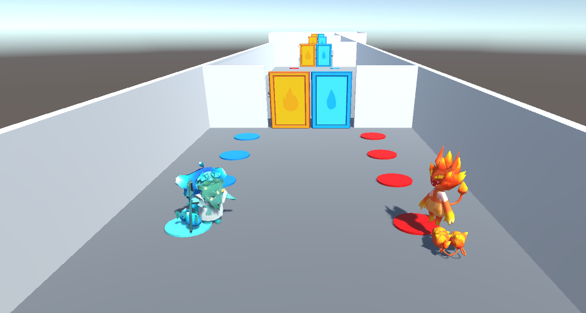

# Elemental Exemplars

A game from [GGJ](https://globalgamejam.org/2022/games/bearded-man-and-horned-dude-4) '22 / [FGJ](http://www.finnishgamejam.com/) '22

An epic adventure of two unlikely friends, trying to get through the challenges of the world. Find new friends along the way and beware the surroundings, as they might not all like each other...

You can play with both keyboard and game pads, or a combination of both.
For keyboard the defaults are WASD and left shift & control,
and the arrow keys and right shift & control.
For gamepad the defaults are left stick and the south and east action buttons:
A and B on Xbox controller and cross and circle on playstation controller.

If the gamepad buttosn do not work, you can try to set them in the button setup menu.
Keyboard keys can also be set there.

NB! However, the button mapping seems to a bit buggy, so buttons can sometimes work
in-game even though they appear to be broken in the menu!

